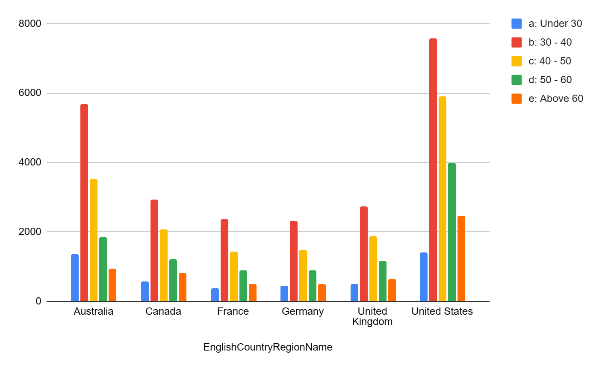
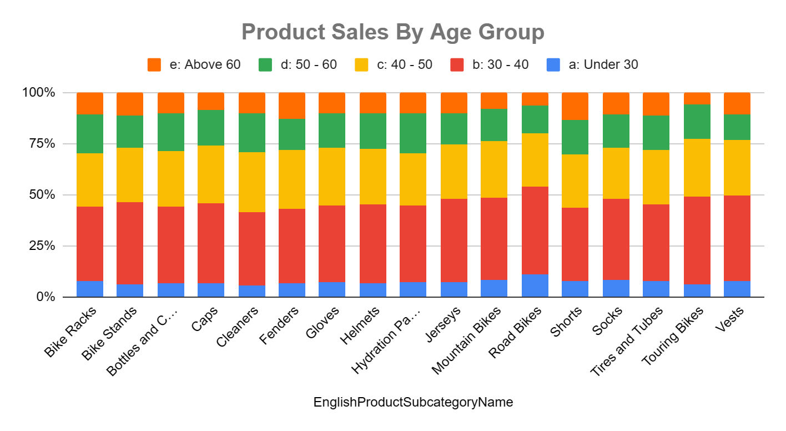
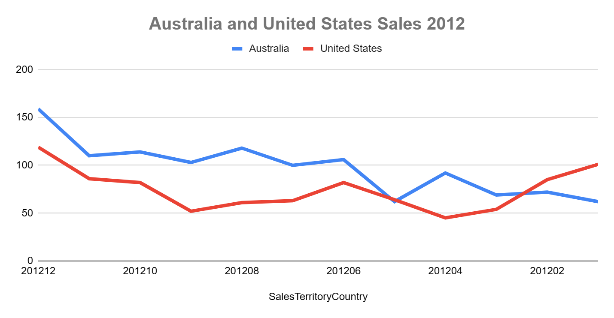
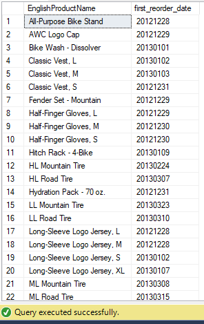
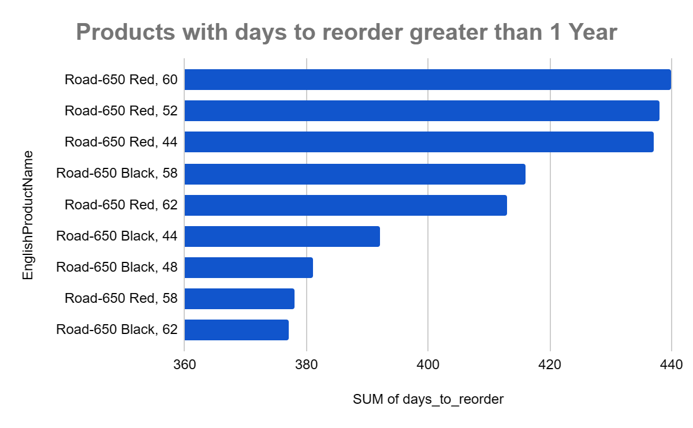
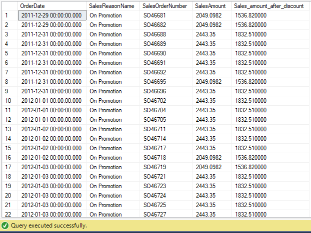
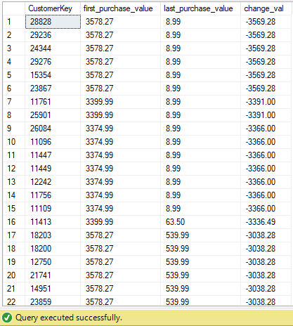

# Data_Analysis_with_SQL
## 1. Sales Distribution by Customer Age Group across Countries
Objective: This analysis aims to provide insights into the distribution of sales across different customer age groups within each country. By categorizing customers into age groups, we can identify patterns and preferences in purchasing behaviour, allowing businesses to tailor marketing strategies accordingly. 

## 2. Show Each product sale by age group
Objective: Understanding how products perform across different age groups is essential for targeted product development and marketing efforts. This analysis breaks down product sales by customer age groups, offering valuable information to optimize inventory, marketing, and product placement strategies.

## 3. Show Monthly Sales for Australia and USA Compoared for the Year 2012

Objective: By comparing the monthly sales figures between Australia and the USA for the year 2012, this analysis aims to identify trends, seasonality, and potential opportunities or challenges in each market. This insight is crucial for strategic planning and resource allocation. 

## 4. Displaying First Re-Order Date for Each Product

Objective: Utilizing the DimInternetSales and Product tables, this analysis provides information on the first re-order date for each product. Knowing when a product is typically re-ordered is vital for managing inventory efficiently, ensuring products are restocked at the right time.

## 5. Days Between First Order and First Re-Order for Q4 Products

Objective: This analysis calculates the days between the first order and the first re-order for products in Q4. By identifying products that take over a year to re-order, businesses can assess stock levels, potential overstock situations, and adjust their supply chain strategies accordingly.

## 6. Sales on Promotion and Impact of 25% Discount

Objective: Examining sales on promotion and simulating the impact of a 25% discount allows businesses to evaluate the effectiveness of promotions on sales revenue. This insight aids in designing promotional campaigns that maximize customer engagement and revenue growth.

## 7. Customer Sales History: First and Last Sales, and the Difference
Objective: This analysis focuses on providing a comprehensive view of customer sales history, showcasing the value of their initial and most recent purchases. Additionally, it calculates the difference between these two values, offering insights into customer loyalty, retention, and changes in purchasing behavior over time.

